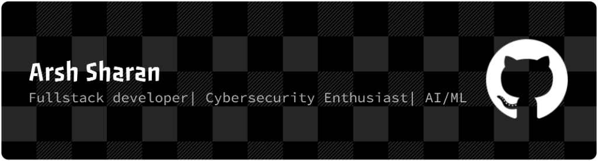

  

 

<a href="https://twitter.com/" target="_blank"></img></a>

<h3>👾 System Status: <i>Online</i></h3>

<table style="border: none; width: 100%;">
  <tr>
    <td width="60%" valign="top" style="border: none;">
      <table style="border: none; width: 100%;">
        <tr>
          <td align="left" valign="top" width="50%">
            <h3>🔭 Mission Log</h3>
             
            - 🌱 <b>Leveling up:</b> Reverse Engineering & Exploits 
            - 🛡️ <b>Building:</b> AI-Powered Security Tools 
            - 🚩 <b>Activity:</b> CTF Player & Red Teamer
          </td>
          <td align="left" valign="top" width="50%">
            <h3>📡 Transmission</h3>
             
            - 💬 <b>Intel:</b> Ethical Hacking, AI, Backend Security 
            - 📫 <b>Comms:</b> <a href="mailto:arshsharan06@gmail.com">arshsharan06@gmail.com</a> 
            - ⚡ <b>Secret:</b> I hunt for hidden data in pixels (Steganography)
          </td>
        </tr>
      </table>
    </td>
    <td width="40%" valign="center" align="center" style="border: none;">
      
    </td>
  </tr>
</table>

 

 &ensp; <b> Things I code with</b>
 

  
  
  
  
  
  
  
  
  
  

 

  

     &ensp;
    <b>Stats Overview</b>
  

   

  

    
      
    
    
      
    
    
      
    
  

 

  

     &ensp;
    <b>Weekly development breakdown</b>
  

  
  <!--START_SECTION:waka-->
  <!--END_SECTION:waka-->

 

<h3 align="center">😂 Random Joke of the Day</h3>

  
<!-- JOKE-START -->
> Did you hear about the guy whose whole left side was cut off?
> He's all right now.
<!-- JOKE-END -->

 
